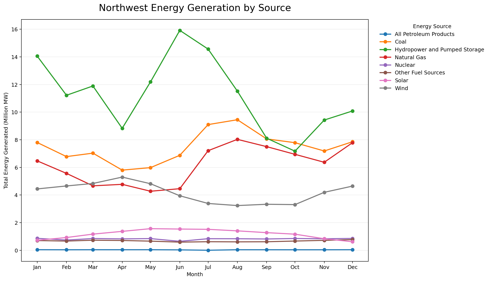
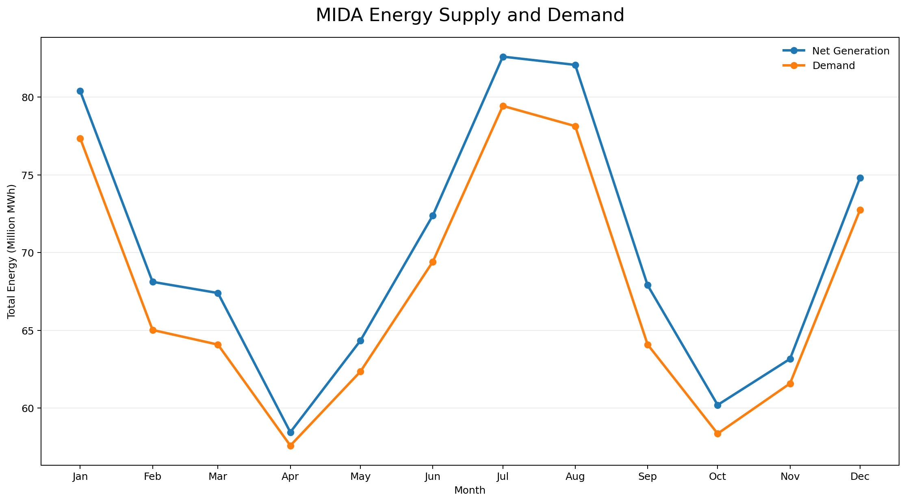
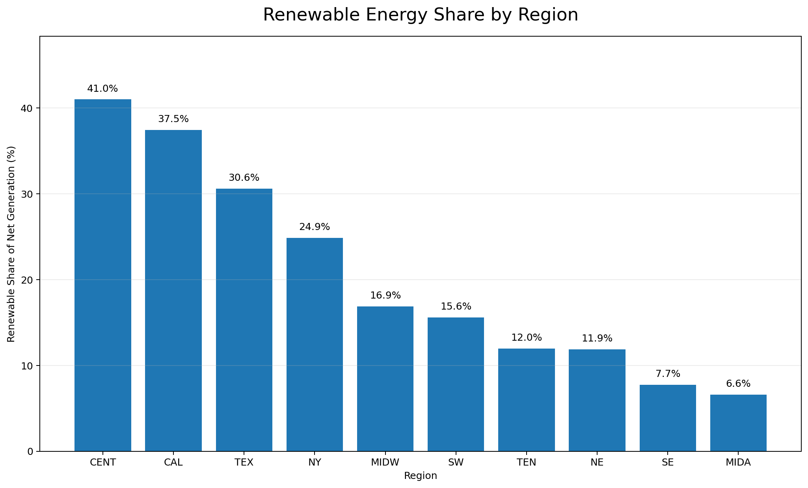

# Intel Data Center Energy Analysis

**Tableau Portfolio Case Study | Energy Analytics | Data Visualization | Decision Support**

## Project Overview

This project analyzes regional U.S. electricity generation and demand data to evaluate energy availability, renewable-energy utilization, and power-source composition relevant to data center sustainability decisions.

Using Tableau, I analyzed energy generation across regions and fuel sources, compared electricity supply with demand, and calculated the percentage of regional generation supplied by renewable energy.

The analysis demonstrates how energy data can be transformed into visual insights that support infrastructure and sustainability decision-making.

> **Portfolio Note:** This is an educational portfolio project. The project was completed using a provided dataset and does not represent employment, consulting work, or proprietary analysis performed for Intel.

---

## Business Problem

Data centers require significant and reliable electricity while organizations increasingly consider the environmental impact of their infrastructure.

The analysis focused on three questions:

1. How does electricity generation vary by energy source?
2. How closely does regional electricity generation align with demand?
3. Which regions have the greatest share of electricity generation coming from renewable sources?

---

## Data

The analysis uses hourly regional electricity data containing measures for electricity demand, net generation, and generation by energy source.

Key fields include:

- Region
- Local Time at End of Hour
- Demand
- Net Generation
- Coal
- Natural Gas
- Nuclear
- Petroleum
- Hydropower and Pumped Storage
- Solar
- Wind
- Other Fuel Sources

The primary dataset contains approximately **549,000 hourly records**.

Large source datasets are not included in this repository due to file-size considerations. The Tableau workbook structure (`.twb`) is included to demonstrate the underlying analysis.

---

## Tools & Tableau Techniques

- Tableau
- Calculated Fields
- Time-Series Analysis
- Regional Filtering
- Aggregation
- Comparative Analysis
- Data Visualization
- Energy Mix Analysis
- KPI Development
- Business Decision Support

---

## Analysis & Findings

### 1. Energy Generation by Source

I analyzed monthly electricity generation by source to understand how the regional energy mix changes throughout the year.



The analysis shows substantial differences in generation volume across energy sources and demonstrates that the regional electricity supply depends on a diversified generation mix.

---

### 2. Electricity Supply and Demand

I compared net electricity generation with demand to evaluate whether regional production patterns generally tracked electricity requirements.



Across the analyzed period, net generation and demand followed similar seasonal patterns. Generation remained above demand in the displayed MIDA regional analysis, while both measures increased during higher-demand periods.

This relationship illustrates the importance of evaluating both electricity availability and consumption requirements when considering energy-intensive infrastructure.

---

### 3. Renewable Energy by Region

To compare regional renewable-energy utilization, I created a calculated field combining wind, solar, and hydropower generation.

**Renewable Energy**

```text
Wind + Solar + Hydropower and Pumped Storage
```

I then calculated renewable generation as a percentage of total net generation:

```text
Renewable Percentage =
100 × SUM(Renewable Energy) / SUM(Net Generation)
```



Renewable-energy contribution varies substantially across regions. In this analysis, **CENT and CAL had the highest renewable shares among the displayed regions**, while **MIDA had the lowest**.

This variation suggests that location can materially affect the renewable-energy profile available to electricity-intensive operations.

---

## Key Findings

- Regional energy portfolios vary considerably in their use of different generation sources.
- Electricity generation and demand exhibit similar seasonal patterns in the analyzed MIDA region.
- Renewable-energy penetration differs significantly across regions.
- CENT and CAL showed the strongest renewable-energy shares among the regions analyzed.
- Energy availability alone does not provide a complete sustainability picture; generation mix and renewable contribution also matter.

---

## Business Recommendation

For sustainability-focused data center planning, regional evaluation should consider both **electricity reliability and energy composition** rather than relying on total generation capacity alone.

Regions with stronger renewable-energy contributions may offer advantages for sustainability objectives, while supply-and-demand patterns should also be evaluated to ensure adequate electricity availability.

Additional site-selection analysis should incorporate factors such as electricity cost, grid reliability, carbon intensity, infrastructure capacity, and projected data center demand before making an investment decision.

---

## Tableau Workbook

The repository includes:

**`intel-data-center-energy-analysis.twb`**

This file contains the Tableau workbook structure used for the analysis. The large underlying source datasets are excluded from the repository because of file-size considerations.

---

## Skills Demonstrated

**Tableau | Data Visualization | Calculated Fields | Time-Series Analysis | Data Aggregation | Energy Analytics | KPI Analysis | Business Analysis | Sustainability Analytics | Decision Support**
